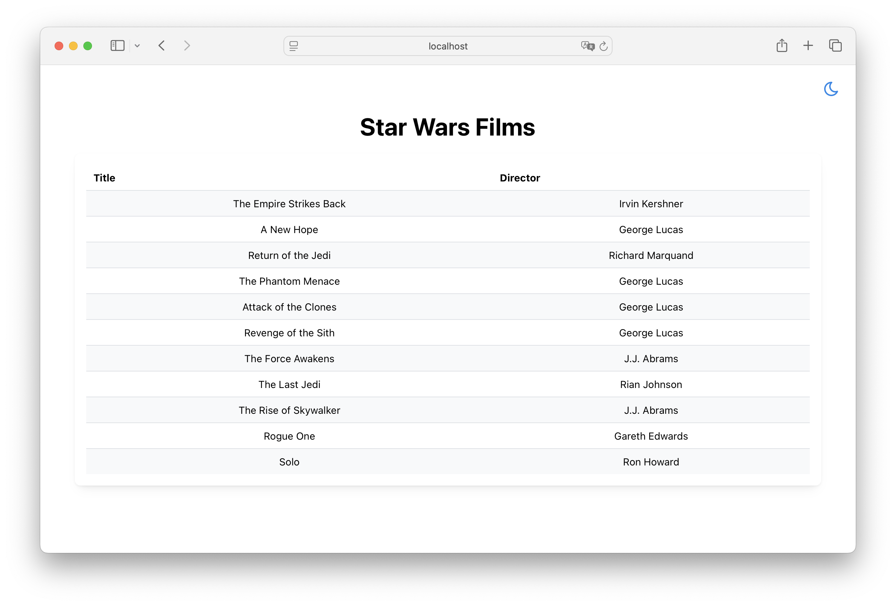

# Overview

This project demonstrates a Web project of React frontend + Python backend communicating via GraphQL

In this example, the frontend renders a Star War film list provided in [`api/main.py`](api/main.py)



## frontend

[`frontend`](frontend/) is a React + Relay + TypeScript project template

## api

[`api`](api/) is a python + FastAPI + Strawberry GraphQL server template


## Syncing GraphQL schema

```
# to get the GQL schema
strawberry export-schema main > ../frontend/src/graphql_schema/local_schema.graphql

# then run this under frontend
npm run relay
```

# How to hack this project

## Develop Environment

### Starting Development Environment

**Method 1: Start Separately (Recommended)**

1. Start Backend API:
   ```bash
   pip install poetry

   cd api
   poetry run uvicorn main:app --reload --port 9000
   ```

2. Start Frontend Dev Server:
   ```bash
   cd frontend
   npm run dev
   ```
### Access URLs

- **Frontend Dev Server**: http://localhost:5173
- **Backend API**: http://localhost:9000/graphql

### Hot Reload Features

✅ **Frontend Hot Reload**: Changes to files under `frontend/src/` automatically refresh the browser
✅ **Backend Hot Reload**: Changes to files under `api/` automatically restart uvicorn
✅ **API Proxy**: Frontend automatically proxies `/graphql` path to backend API

### Development Workflow

1. Modify frontend code → Browser auto-refreshes
2. Modify backend code → API auto-restarts
3. No need to manually restart any services

## Production Environment

The production environment uses a single port (9000) to serve both frontend and backend.

### Building for Production

1. **Build Frontend**:
   ```bash
   cd frontend
   npm run build
   ```
   This generates production files in `frontend/dist/` directory.

2. **Start Production Server**:
   ```bash
   cd api
   poetry run uvicorn main:app --host 0.0.0.0 --port 9000
   ```

### Access URLs

- **Frontend**: http://localhost:9000/
- **API**: http://localhost:9000/graphql

